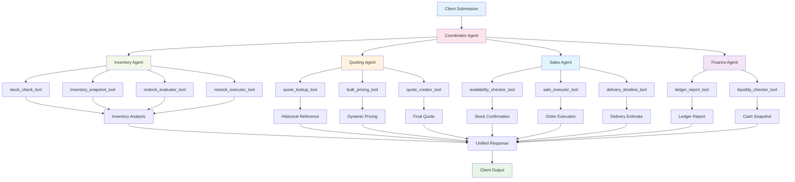

# 🦫 Beaver’s Choice Paper Company - Autonomous Fulfillment System

Welcome to the internal simulation tool used by **Beaver’s Choice Paper Co.**, a fictional supply company powered by a smart multi-agent architecture. This system models intelligent request handling across inventory, quoting, sales, and financial workflows using Python, SQLite, and agentic logic.

## 📐 Architecture: Smart Workflow Blueprint

## 🧠 Agent Responsibilities

Each agent at Beaver’s Choice plays a dedicated role in the fulfillment pipeline. The system is modular, with clearly scoped functionality and minimal overlap.

### 1. 🪵 Coordinator Agent (Orchestrator)

**Mission**: Direct the flow from intake to output
**Key Functions**:

* `parse_customer_request()`: Interprets and extracts item demands
* `call_multi_agent_system()`: Delegates tasks across agents based on request context

### 2. 📦 Inventory Agent

**Mission**: Maintain stock visibility and restock readiness
**Tools & Mappings**:

* `stock_check_tool` → `get_stock_level()`
* `inventory_snapshot_tool` → `get_all_inventory()`
* `restock_evaluator_tool` → `get_supplier_delivery_date()`
* `restock_executor_tool` → `create_transaction()`

### 3. 🧾 Quoting Agent

**Mission**: Deliver competitive, data-driven price quotes
**Tools & Mappings**:

* `quote_lookup_tool` → `search_quote_history()`
* `bulk_pricing_tool` → `get_all_inventory()` + custom logic
* `quote_creator_tool` → Custom quote generator

### 4. 🛒 Sales Agent

**Mission**: Confirm feasibility and process customer orders
**Tools & Mappings**:

* `availability_checker_tool` → `get_stock_level()`
* `delivery_timeline_tool` → `get_supplier_delivery_date()`
* `sale_executor_tool` → `create_transaction()`

### 5. 💰 Finance Agent

**Mission**: Monitor cashflow and asset health
**Tools & Mappings**:

* `ledger_report_tool` → `generate_financial_report()`
* `liquidity_checker_tool` → `get_cash_balance()`

## 🔄 Workflow Sequence

### 🛠 Step-by-Step Simulation Flow

1. **Customer request is received** by the Coordinator
2. **Inventory Agent** evaluates stock or initiates restock
3. **Quoting Agent** references history and calculates custom quote
4. **Sales Agent** verifies fulfillment and processes the order
5. **Finance Agent** updates the books and generates cashflow reports
6. **Coordinator** returns a final, consolidated response to the client

### 🔌 System Interactions

* All database interactions are backed by SQLite and SQLAlchemy
* Agents communicate through clean function calls and shared context
* State is maintained across transaction steps, ensuring data consistency
* Failures are handled gracefully by each agent with fallback strategies

## 🧰 Helper Function Coverage

| Helper Function                | Used By                        |
| ------------------------------ | ------------------------------ |
| `create_transaction()`         | Inventory Agent, Sales Agent   |
| `get_all_inventory()`          | Inventory Agent, Quoting Agent |
| `get_stock_level()`            | Inventory Agent, Sales Agent   |
| `get_supplier_delivery_date()` | Inventory Agent, Sales Agent   |
| `get_cash_balance()`           | Finance Agent                  |
| `generate_financial_report()`  | Finance Agent                  |
| `search_quote_history()`       | Quoting Agent                  |

